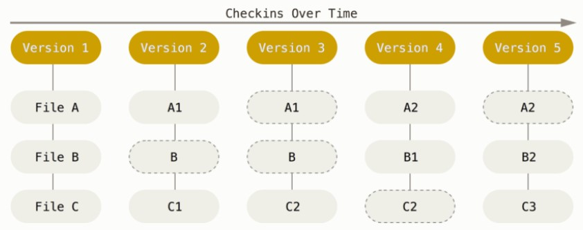
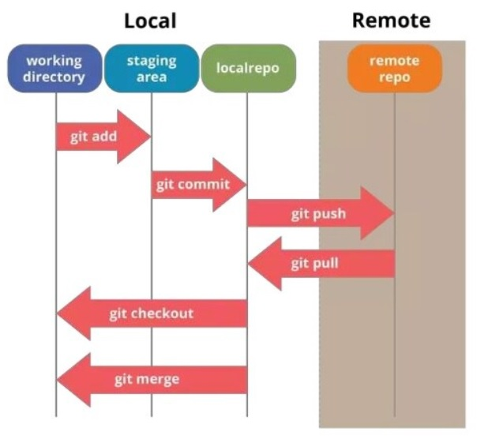
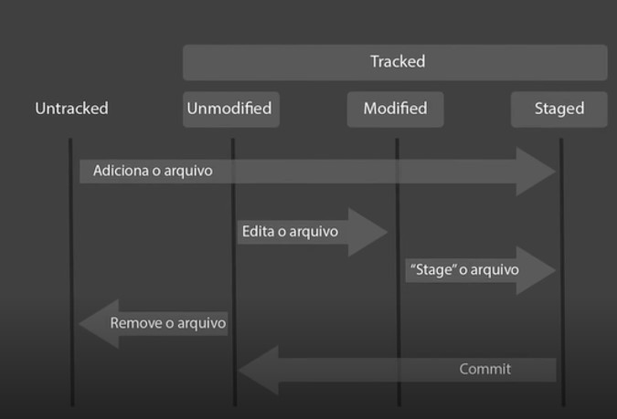

# Desáfio de Projeto sobre Git/GiHub da Dio
Repositório criado para o Desafio de Projeto
## links Úteis
- [Sintaxe Básico Markdown](https://raullesteves.medium.com/github-como-fazer-um-readme-md-bonit%C3%A3o-c85c8f154f8)
- [Editor online para treinar o Markdown](https://dillinger.io/)

---

## **Espere um pouco podemos aprender aqui:**

- [x] __O que é controle de versão?__
- [x] __O que é GIT?__
- [X] __instalação do GIT__
- [x] __Fluxo__

---

## 1. O que é controle de versão?
O controle de versão, também conhecido como controle de fonte, é a prática de rastrear e gerenciar as alterações em um código de software.

### vantagens
* São ferramentas que ajudam os times de desenvolvimento a gerenciar mudanças dos projetos.
* Mantém o registro de toda e qualquer modificação feita no código fonte em um repositório de código.
* Auxilia e acelera o desenvolvimento permitindo comparar diferentes versões do código-fonte, fazer uma junção delas e o gererenciamento de possiveis conflitos.
* Permite acessar qualquer versão do código existente no passado.
* Ajuda previnir e remediar erros cometidos po desenvolvedores no código, possibilitando reverter as mudanças feitas.

## 2. O que é GIT e Github? 
### GIT

Git é um software instalado no computador de desenvolvedor e/ou no servidor para gerenciar as versões do código-fonte do seu projeto. Projetado e desenvolvido em 2005 por Linus Torvalds.

O Git não trata nem armazena seus dados desta forma. Em vez disso, o Git trata seus dados mais como um conjunto de imagens de um sistema de arquivos em miniatura. Toda vez que você fizer um commit, ou salvar o estado de seu projeto no Git, ele basicamente tira uma foto de todos os seus arquivos e armazena uma referência para esse conjunto de arquivos.
>O Git trata seus dados mais como um **fluxo do estado dos arquivos**.


### GITHUB
GitHub é uma plataforma hospedagem de código-fonte na nuvem (ou em um servidor local) com controle de versão usando o Git.

## 3. Fluxo de trabalho do Git
### Introdução as Estações no git
Git trabalha com três estágios da versão local do código
* **Working Directory( código atual)** -onde altera o código de trabalho,em outras palavras, onde está editando, geralmente arquivos ainda não rastreados (área Ubtracked)
* **Index (área de preparo ou temporária)** - onde adiciona o código alterado (na área Tracked stage).
* **HEAD (última versão)** - quando confirma as alterações feitas é registrado um marco uma fotografia de todas os arquivos que estavão no Stage. (commit)
### Introdução ao gerenciamento de Branches
1. geralmente o Git tem o código-fonte principal no branch chamado "master" (versão em produção )
2. O desenvolvedor criar um novo branch para cada funcionalidade nova (/feature) ou mudanças (/bug /correção, etc)
3. Assim que terminar as alterações e etiver tudo pronto, pode integrar as mudanças para o "master"
4. Você pode baixar (pull) as mudanças de um branch para atualizar seu respositório e evitar futuros conflitos

### fluxo básico de trabalho no Git

* Altera o código no diretório de trabalho (add)
* Adiciona as alterações no repositório local (commit)
* Envia as alterações para o reposítorio remoto (push)
* Baica as alteações feitas no repositório remote (pull)
* Acessa um branch do repositório local ou remoto (checksout)
* Integra as mudanças de outro branch para atual (merge)

## 4. Instalação do Git 
visitando a [página](https://git-scm.com/).

Para verificar se foi instalado com sucesso usar o comando:
```
git --version
```

## 5. Git na prática
### configuração iniciais do ambiente git
```
git config --global user.name "João Silva" 
git config --global user.email "exemplo@seuemail.com.br"
```
## Formas de se conectar Git e GitHub
---
### **git clone**
Serve para copiar o repositorio no GitHub para o repositório local.Quando você clona um repositório com git clone, ocorre a criação automática de uma conexão remota chamada origem, que aponta de volta para o repositório clonado.
```
git clone https://github.com/Renato007/dio-desafio-github-primeiro-repositorio.git
```
### **git remote add origin**
O comando git remote add vai criar um novo registro de conexão para um repositório remoto.Em vez de dar acesso em tempo real a outro repositório, eles funcionam como nomes convenientes que podem ser usados para fazer referência a uma URL não tão conveniente
```
git remote add <name> <url>
```
## Comandos de fluxo e de verificação 
---

### **git add**
Alterações ou adições de arquivos propostas são adicionadas ao índice usando o comando add.
```
git add <nome_do_arquivo>
git add * | git add . --> para pegar todos
```
observação : **git add .** movem todos que estão na area não rastreado para a area Tracked.
### **git status**
Serve para verificar o status de cada arquivo ou pasta.
```
git status
```
### **git commit -m "mensagem"**
Serve para confirmar todas as alterações previamente preparadas
```
git commit -m "mensagem"
```
### **git log**
Serve para exibir o historico de commites da ramificação (branch).
```
git log
```
### **git push origen master**
Serve Enviar arquivos/diretórios para o repositório remoto
>O primeiro push de um repositório deve conter o nome do repositório remoto e o branch.
```
git push origen master
```
>Os demais pushes não precisam dessa informação
```
git push
```
### **git pull**
Atualizar repositório local de acordo com o repositório remoto
>
```
git pull
```

### **git checkout -b [nome]**
Criar uma branch e trocar
>
```
git checkout -b [nome branch]
```
### **git checkout master**
Serve para voltar para a branch principal
>
```
git checkout master
```
### **git merge**
Para realizar o merge, é necessário estar no branch que deverá receber as alterações.
>
```
git merge [nome branch]
```
## Comandos de remoção ou apagar
---
### **git rm [arquivo]**
remover arquivo
```
git rm meu_arquivo.txt
```
### **git rm -r[pasta]**
remover arquivo
```
git rm -r diretorio
```
### **git rm -r[pasta]**
remover arquivo
```
git rm -r diretorio
```
## Comandos para desfazer operações
---
### **git checkout -- <file> | git checkout Head <file> **
Desfazendo alteração local (working directory) de um arquivo. 
```
git checkout -- meu_arquivo.txt
git checkout Head <file>
```
---
### **git reset HEAD meu_arquivo.txt**
Desfazendo alteração local (staging area)
```
git reset HEAD meu_arquivo.txt
```
### **git reset -hard HEAD**
Descarte todas as mudanças locais em seu diretório de trablho
```
git reset -hard HEAD
```
### **git reset -hard <commit>**
Redefina o ponteiro HEAD para um commit anterior e descarte todas as alterações desde então.
```
git reset -hard <commit>
```
### **git revert <commit>**
Reverte um commit (produzindo um novo commit com mudanças)
```
git reset -hard <commit>
```
[Mais informações de comandos git](https://gist.github.com/leocomelli/2545add34e4fec21ec16)

# Você já ouviu falar de Git Flow?
É um fluxo de trabalho para o Git criado para facilitar o processo de desenvolvimento com uma série de comandos novos. O nome por trás desse modelo é Vincent Driessen que, em 2010, escreveu em seu blog pessoal a maneira que ele pensou ser a mais simples de se trabalhar com o Git em larga escala.

Saiba mais <https://blog.betrybe.com/git/git-flow/#1>
